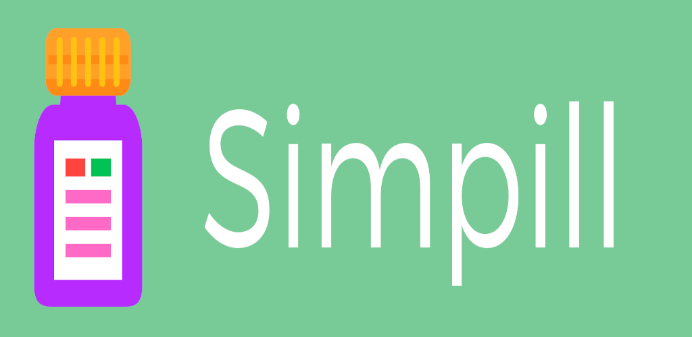

# Simpill

Simpill is a free and open-source Android app for medication reminders. It does not contain any ads, trackers or unnecessary permissions.

<b>Features:</b>

* Medication reminders.
* Refill reminders and supply counter.
* Bottle colors for each medication.
* Fullscreen alarms or regular notifications.
* Alarm audio file selection.
* Multiple app themes.
* Optional sticky notifications.
* 12 or 24 hour time formatting.
* A cat you will inevitably find.